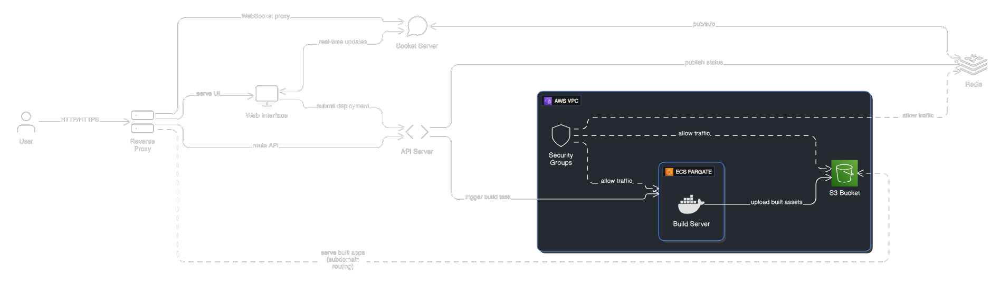

# Skywalker

Automated deployment platform for web applications with real-time monitoring and AWS integration.

## Architecture Overview

Skywalker is a microservices-based deployment platform that automates the build and hosting process for web applications. The system consists of multiple independent services that work together to provide a complete deployment pipeline.



### Core Components

#### 1. Reverse Proxy (`reverse-proxy/`)
- **Port**: 8000
- **Purpose**: Central entry point for all requests
- **Features**:
  - Routes API requests to the API server
  - Serves the web interface on the main domain
  - Handles subdomain routing for deployed applications
  - WebSocket proxy for real-time communication
  - CORS handling

#### 2. API Server (`api-server/`)
- **Port**: 9000
- **Purpose**: Handles deployment requests and AWS orchestration
- **Features**:
  - Receives git repository URLs for deployment
  - Generates unique slugs for projects
  - Triggers AWS ECS tasks for building applications
  - Health monitoring endpoints
  - Integration with AWS services (ECS, S3)

#### 3. Socket Server (`socket-server/`)
- **Port**: 9001
- **Purpose**: Real-time communication and status updates
- **Features**:
  - WebSocket connections using Socket.IO
  - Redis integration for scalable messaging
  - Real-time deployment status updates
  - Live monitoring capabilities

#### 4. Web Interface (`interface/`)
- **Port**: 3000
- **Purpose**: User-facing web application
- **Features**:
  - Simple HTML interface for deployments
  - Form submission for git repositories
  - Real-time status updates via WebSocket

#### 5. Build Server (`build-server/`)
- **Platform**: Docker container on AWS ECS
- **Purpose**: Isolated build environment for applications
- **Features**:
  - Ubuntu-based container with Node.js and Git
  - Clones repositories and builds applications
  - Uploads built assets to S3
  - Ephemeral execution model

### Infrastructure

#### AWS Integration
- **ECS Fargate**: Runs build containers on-demand
- **S3**: Hosts static assets and built applications
- **VPC**: Network isolation with public subnets
- **Security Groups**: Network access control

#### Storage
- **Redis**: Message queuing and session management
- **S3 Bucket**: Static file hosting with public access

### Deployment Flow

1. User submits git repository URL through web interface
2. API server generates unique project slug
3. API server triggers ECS task with build server container
4. Build server clones repository and builds application
5. Built assets are uploaded to S3
6. Real-time status updates sent via Socket server
7. Application becomes accessible via subdomain routing

### Configuration

Each service requires environment-specific configuration:

- **API Server**: AWS credentials, ECS cluster details
- **Socket Server**: Redis connection details
- **Reverse Proxy**: Service port mappings
- **Build Server**: S3 bucket configuration

### Scripts

- `start.js`: Orchestrates all services startup
- `deploy.js`: Command-line deployment interface
- `health-check.js`: Service health monitoring
- `status.js`: System status reporting
- `check-env.js`: Environment validation

### Development

```bash
# Install dependencies for all services
npm run install:all

# Start all services
npm start

# Start individual services
npm run start:api
npm run start:socket
npm run start:proxy
npm run start:interface
```

### Monitoring

- Health endpoints available for all services
- Real-time status monitoring via Socket connections
- Centralized logging through service orchestration
- AWS CloudWatch integration for build containers

## Technology Stack

- **Runtime**: Node.js
- **Web Framework**: Express.js
- **Real-time**: Socket.IO
- **Cloud**: AWS (ECS, S3)
- **Cache/Queue**: Redis
- **Containerization**: Docker
- **Proxy**: HTTP Proxy middleware

## Troubleshooting

### Redis Connection Issues

If you encounter `MaxRetriesPerRequestError` or `ECONNREFUSED` errors when trying to connect to Redis:

1. **Verify SERVICE_URI Configuration**: 
   - Ensure `SERVICE_URI` is properly set in all `.env.local` files
   - Check that the Redis endpoint is accessible from your environment

2. **Environment Variable Propagation**:
   - The API server now automatically passes `SERVICE_URI` to ECS build tasks
   - Build containers have built-in error handling for Redis connection failures

3. **Graceful Degradation**:
   - The build server will continue to work even if Redis is unavailable
   - Logs will still be written to console output
   - Socket server will skip Redis subscription if connection fails

4. **Check Environment**:
   ```bash
   node scripts/check-env.js
   ```

### Common Issues

- **Missing Dependencies**: Run `npm run install:all` to install all service dependencies
- **Port Conflicts**: Check if ports 3000, 8000, 9000, 9001 are available
- **AWS Permissions**: Verify AWS credentials have ECS and S3 permissions
- **Container Build Failures**: Check AWS ECS task logs in CloudWatch